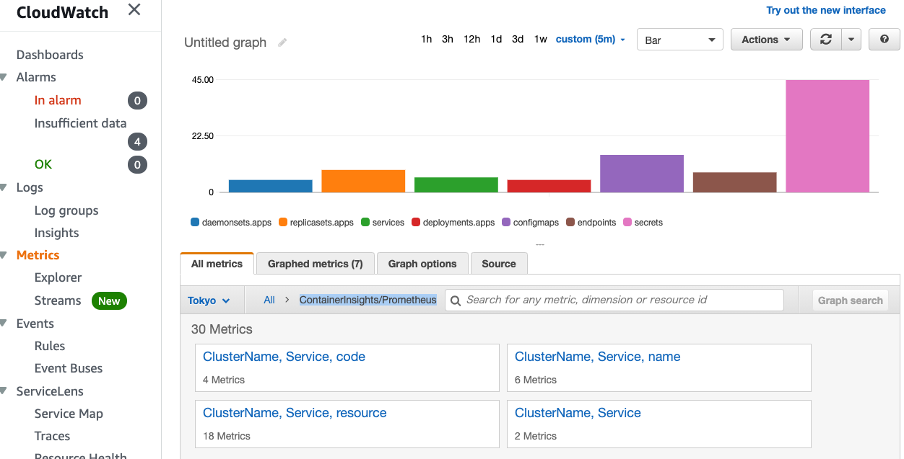

## Amazon EKS Observability DEMO

This project for demonstarating how to work observability on a cluster using EKS with:

* CDK
* CloudWatch Container Insights
* Prometheus, Amazon Managed Service for Prometheus, Amazon Managed Service for Grafana
* AWS Distro for OpenTelemetry
* etc.

## Prerequisites

Running this project require setting up AWS CDK in TypeScript. See also the [Developer Guide](https://docs.aws.amazon.com/cdk/latest/guide/hello_world.html).

## Steps

### Set up some environment variables

```bash
## The name of EKS cluster to be created
export CLUSTER_NAME=observability-demo

## Region unique export names
export CFN_EXPORT_NAME_CLUSTER_NAME=EKSObservabilityDemoClusterName
export CFN_EXPORT_NAME_OIDC_PROVIDER_ARN=EKSObservabilityDemoOIDCProviderArn
export CFN_EXPORT_NAME_KUBECTL_ROLE_ARN=EKSObservabilityDemoKubectlRoleArn
```

### Create a cluster for this demo

```bash
cd base/

## Create a cluster
npm i
npm run cdk diff EKSObservabilityBase
npm run cdk deploy EKSObservabilityBase

## Set up AWS Loadbalancer Controller
npm run cdk diff EKSObservabilityIngressController
npm run cdk deploy EKSObservabilityIngressController

## Set up kubeconfig
aws eks update-kubeconfig --name observability-demo --region $AWS_REGION --role-arn arn:aws:iam::xxxx:role/EKSObservabilityBase-BaseClusterMastersRoleXXX
```

### Deploy sample applications

```bash
cd app/

kubectl apply -f simple-backend/deployment.yml
kubectl apply -f simple-frontend/deployment.yml

## Make sure that the ingress URL can be accessed.
open http://$(kubectl get ingress simple-frontend -o jsonpath='{.status.loadBalancer.ingress[0].hostname}')
```

### Set up Amazon CloudWatch Container Insights

The step introduces a cloudwatch-agent DaemonSet for sending metrics to Container Insights.

```bash
cd observability/

## Create a cluster
npm i
npm run cdk diff EKSObservabilityCloudWatchNamespace
npm run cdk deploy EKSObservabilityCloudWatchNamespace

## Make sure the namespace have been created
kubectl get ns amazon-cloudwatch -o yaml

## Deploy a cloudwatch-agent in the cluster
npm run cdk diff EKSObservabilityContainerInsights
npm run cdk deploy EKSObservabilityContainerInsights

## Make sure the cloudwatch-agent have been deployed
kubectl describe ds -n amazon-cloudwatch cloudwatch-agent
```

Go to Container Insights and make sure the cluster metrics can be seen:
https://console.aws.amazon.com/cloudwatch/home#container-insights:performance

### Set up cluster logging using CloudWatch Logs

The step introduces a fluent-bit DaemonSet for sending cluster logs (application, dataplane, host) to CloudWatch Logs

```bash
## Deploy a cloudwatch-agent in the cluster
npm run cdk diff EKSObservabilityClusterLogging
npm run cdk deploy EKSObservabilityClusterLogging

## Make sure the fluent-bit have been deployed
kubectl describe ds -n amazon-cloudwatch fluent-bit

## Access to the sample app for generating logs
open http://$(kubectl get ingress simple-frontend -o jsonpath='{.status.loadBalancer.ingress[0].hostname}')
```

Go to a Log Group for the cluster.

* [Application](https://console.aws.amazon.com/cloudwatch/home#logsV2:log-groups/log-group/$252Faws$252Fcontainerinsights$252Fobservability-demo$252Fapplication)
* [Data Plane (kubelet)](https://console.aws.amazon.com/cloudwatch/home#logsV2:log-groups/log-group/$252Faws$252Fcontainerinsights$252Fobservability-demo$252Fdataplane)
* [Node](https://console.aws.amazon.com/cloudwatch/home#logsV2:log-groups/log-group/$252Faws$252Fcontainerinsights$252Fobservability-demo$252Fhost)

### Set up application tracing using AWS X-Ray

The step introduces a X-Ray DaemonSet for sending application trace data.

```bash
## Deploy a X-Ray agent in the cluster
npm run cdk diff EKSObservabilityXRay
npm run cdk deploy EKSObservabilityXRay

## Make sure the agent have been deployed
kubectl describe ds -n amazon-cloudwatch xray-daemon

## Restart sample apps for a new DNS info of X-Ray Daemon
kubectl -n default rollout restart deploy/simple-frontend
kubectl -n default rollout restart deploy/simple-backend

## Access to the sample app for generating logs
open http://$(kubectl get ingress simple-frontend -o jsonpath='{.status.loadBalancer.ingress[0].hostname}')
```

Go to [X-Ray Console](https://console.aws.amazon.com/xray/home#/service-map)

### Set up CloudWatch agent for Prometheus metrics

The step introduces a CloudWatch Agent for Prometheus for sending Prometheus metrics as log data to CloudWatch Logs.

```bash
## Deploy a cwagent-prometheus in the cluster
npm run cdk diff EKSObservabilityPrometheusCloudWatch
npm run cdk deploy EKSObservabilityPrometheusCloudWatch

## Make sure the cwagent-prometheus have been deployed
kubectl describe deploy -n amazon-cloudwatch cwagent-prometheus
```

Go to [Prometheus metrics (EMF log)](https://console.aws.amazon.com/cloudwatch/home#logsV2:log-groups/log-group/$252Faws$252Fcontainerinsights$252Fobservability-demo$252Fprometheus)

Go to custome metrics on CloudWatch: `ContainerInsights/Prometheus`



### Set up Amazon Managed Service for Prometheus and AWS Distro for OpenTelemetry

```bash
export APS_REGION=us-west-2
export APS_WORKSPACE_ID=$(aws --region $APS_REGION amp create-workspace --query workspaceId --output text)
export APS_REMOTE_WRITE_ENDPOINT=https://aps-workspaces.$APS_REGION.amazonaws.com/workspaces/$APS_WORKSPACE_ID/api/v1/remote_write

envsubst < resources/adot-configmap.yaml > dist/adot-configmap.yaml
npm run cdk diff EKSObservabilityOpenTelemetry
npm run cdk deploy EKSObservabilityOpenTelemetry

kubectl get all -n adot-col

# Get Metrics by using awscurl(https://github.com/okigan/awscurl)
awscurl --service="aps" --region="$APS_REGION" "https://aps-workspaces.$APS_REGION.amazonaws.com/workspaces/$APS_WORKSPACE_ID/api/v1/query?query=adot_rest_client_requests_total"

## Deploy sample apps using X-Ray via OpenTelemetry
cd ../
kubectl apply -f apps/simple-frontend-otel/deployment.yml 
open http://$(kubectl get ingress simple-frontend-otel -o jsonpath='{.status.loadBalancer.ingress[0].hostname}')/hello-world
```

Go to [X-Ray Console](https://console.aws.amazon.com/xray/home#/service-map)

### Clean up

```bash
cd apps
kubectl delete -f simple-backend/deployment.yml
kubectl delete -f simple-frontend/deployment.yml
kubectl delete -f simple-frontend-otel/deployment.yml 

cd ../observability
aws --region $APS_REGION amp delete-workspace --workspace-id $APS_WORKSPACE_ID
npm run cdk destroy EKSObservabilityOpenTelemetry
npm run cdk destroy EKSObservabilityPrometheusCloudWatch
npm run cdk destroy EKSObservabilityXRay
npm run cdk destroy EKSObservabilityClusterLogging
npm run cdk destroy EKSObservabilityContainerInsights
npm run cdk destroy EKSObservabilityCloudWatchNamespace

cd ../base
npm run cdk destroy EKSObservabilityIngressController
npm run cdk destroy EKSObservabilityBase
```

## Security

See [CONTRIBUTING](CONTRIBUTING.md#security-issue-notifications) for more information.

## License

This library is licensed under the MIT-0 License. See the LICENSE file.
